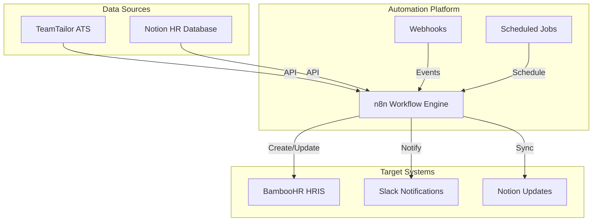

# System Architecture Overview

## High-Level Architecture



## Component Details

### 1. TeamTailor (Source System)
**Purpose**: Applicant Tracking System
- Manages job postings
- Tracks candidates
- Handles offers and hiring

**Integration Points**:
- REST API for data retrieval
- Webhooks for real-time events
- Custom fields for additional data

### 2. Notion (Dual Role: Source & Target)
**Purpose**: HR Planning and Database
- Department structure
- Job requisitions
- Employee records
- Salary information

**Integration Points**:
- API v2 for CRUD operations
- Database relations
- Real-time sync capabilities

### 3. n8n (Automation Engine)
**Purpose**: Workflow orchestration
- Connects all systems
- Transforms data
- Handles business logic
- Error management

**Key Features**:
- Visual workflow builder
- Built-in error handling
- Extensive node library
- Custom code support

### 4. BambooHR (Target System)
**Purpose**: HR Information System
- Employee records
- Onboarding
- Time off management
- Reports

**Integration Points**:
- REST API
- Custom fields
- Bulk operations

### 5. Slack (Notification System)
**Purpose**: Team communication
- Real-time alerts
- Error notifications
- Status updates

**Integration Points**:
- Incoming webhooks
- Formatted messages
- Interactive buttons

## Data Flow Patterns

### Pattern 1: Scheduled Synchronization
```
Notion → n8n (CRON) → TeamTailor
         ↓
    Data Transform
         ↓
    Update Records
```

**Use Case**: Department structure sync
**Frequency**: Weekly
**Volume**: ~50-100 records

### Pattern 2: Event-Driven Processing
```
TeamTailor (Webhook) → n8n → Process
                        ↓
                    Transform
                        ↓
                BambooHR + Notion + Slack
```

**Use Case**: New hire onboarding
**Trigger**: Candidate hired event
**SLA**: < 3 minutes

### Pattern 3: On-Demand Operations
```
Notion (Change) → n8n (Manual) → TeamTailor
                    ↓
                Validate
                    ↓
            Create Requisition
```

**Use Case**: Job posting creation
**Trigger**: Manual or API call
**Processing**: Immediate

## Security Architecture

### Authentication Methods
| System | Method | Storage |
|--------|--------|---------|
| TeamTailor | Bearer Token | n8n Credentials |
| BambooHR | API Key | n8n Credentials |
| Notion | Integration Token | n8n Credentials |
| Slack | Webhook URL | n8n Credentials |

### Data Security
- **Encryption**: TLS 1.2+ for all API calls
- **Credentials**: Stored encrypted in n8n database
- **Access Control**: Role-based in each system
- **Audit Logs**: Maintained in n8n and target systems

### Compliance Considerations
- GDPR compliance for EU employees
- PII handling protocols
- Data retention policies
- Right to erasure support

## Scalability Design

### Current Capacity
- **Transactions**: 1000/day
- **Concurrent Workflows**: 10
- **Data Volume**: 10GB
- **Response Time**: < 5 seconds

### Scaling Strategy
1. **Vertical Scaling**: Increase n8n instance resources
2. **Horizontal Scaling**: Multiple n8n workers
3. **Caching**: Redis for frequently accessed data
4. **Queue Management**: RabbitMQ for high volume

### Performance Optimization
- Batch API calls where possible
- Implement pagination for large datasets
- Use webhooks vs polling
- Cache static data (departments, locations)

## Error Handling & Recovery

### Error Types
1. **API Errors**: Rate limits, authentication
2. **Data Errors**: Validation, missing fields
3. **Network Errors**: Timeouts, connection issues
4. **Business Logic**: Duplicate records, conflicts

### Recovery Strategies
```javascript
// Retry with exponential backoff
const retryOperation = async (operation, maxRetries = 3) => {
  for (let i = 0; i < maxRetries; i++) {
    try {
      return await operation();
    } catch (error) {
      if (i === maxRetries - 1) throw error;
      await sleep(Math.pow(2, i) * 1000);
    }
  }
};
```

### Monitoring & Alerting
- **Metrics**: Success rate, processing time, error rate
- **Logging**: Centralized in n8n
- **Alerts**: Slack notifications for failures
- **Dashboard**: n8n execution history

## Deployment Architecture

### Environment Setup
```
Production
├── n8n Instance (Docker/K8s)
├── PostgreSQL Database
├── Redis Cache (optional)
└── Monitoring Stack

Development
├── Local n8n
├── Test Databases
└── Mock APIs
```

### CI/CD Pipeline
1. **Version Control**: Git for workflows
2. **Testing**: Automated workflow tests
3. **Deployment**: Docker containers
4. **Rollback**: Previous version restore

## Technology Stack

### Core Technologies
- **Runtime**: Node.js 18+
- **Database**: PostgreSQL 14+
- **Queue**: Bull (built into n8n)
- **Cache**: Redis (optional)

### Infrastructure
- **Container**: Docker
- **Orchestration**: Kubernetes (optional)
- **Monitoring**: Prometheus + Grafana
- **Logging**: ELK Stack (optional)

## Disaster Recovery

### Backup Strategy
- **Workflows**: Daily export to Git
- **Credentials**: Encrypted backup
- **Database**: Daily snapshots
- **Documentation**: Version controlled

### Recovery Procedures
1. **Service Failure**: Auto-restart with supervisor
2. **Data Loss**: Restore from backup
3. **Credential Compromise**: Rotate all keys
4. **System Corruption**: Rebuild from Docker image

## Future Architecture Considerations

### Planned Enhancements
1. **AI Integration**: OpenAI for data enrichment
2. **Advanced Analytics**: Power BI connection
3. **Mobile Notifications**: Push notifications
4. **Multi-tenancy**: Support multiple companies

### Technical Debt
- Refactor large workflows into smaller ones
- Implement proper testing framework
- Add comprehensive logging
- Create workflow templates library